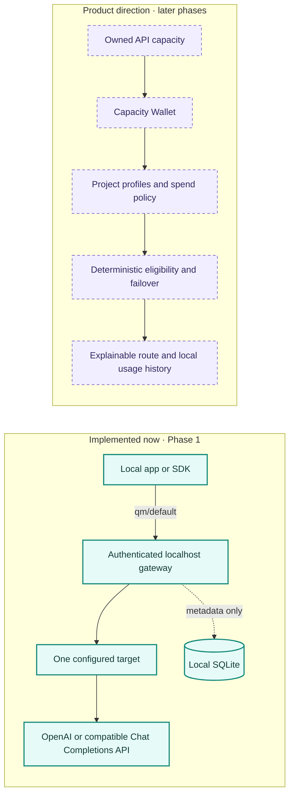

<div align="center">

# QuotaMesh


### Your local AI API capacity wallet

Connect the AI API access you already own, shape it around your projects, and make every route explainable and spend-aware.

<a href="https://github.com/yashsrivastava0/QuotaMesh/actions/workflows/ci.yml"></a>


<br>

[Quick start](#quick-start) · [Product story](#the-product-story) · [Architecture](#how-it-works) · [Roadmap](#roadmap) · [Contributing](#development-and-contributions)

</div>

> **Honest status:** this repository implements **Phase 1 — secure local pass-through**. It gives compatible clients one authenticated local endpoint for one configured provider target. The multi-source wallet, per-project policies, route explanations, and automatic failover are the product direction and roadmap; they are not implemented yet.

## The product story

AI access tends to live in separate provider accounts, keys, plans, and project settings. QuotaMesh is designed to make that capacity easier to understand and use responsibly from local projects.

The product's north star is a **local AI capacity wallet**: connect the free, trial, and paid API access you already own; allocate it to named project profiles; see what each profile can safely use; and recover from eligible provider failures according to rules you set. QuotaMesh does not create quota, remove provider limits, or make paid usage free.

### The differentiation is the workflow

The product spec's market review found that provider breadth, key rotation, free-tier pooling, and generic fallback already exist across gateway products. QuotaMesh's product thesis is the composition: **a local view of personally owned capacity, allocation by project, explicit paid-use policy, and an explanation for what is usable or blocked**. Its target is the solo developer or small builder managing mixed access across local projects. The spec does not claim any one gateway primitive is unique; it argues this focused local workflow is the useful product. The market review and its source date are documented on pages 5–13 of the [product spec](QuotaMesh_MVP_Architecture_Product_Spec_v0.3.pdf).

### Why this product model

- **Own your capacity:** see access you already control across free, trial, and paid plans.
- **Allocate by project:** set each app's allowed targets and spend policy instead of sharing one global rule.
- **Keep decisions explainable:** make routing follow explicit order and evidence; report unknown quota as unknown.
- **Stay local and spend-aware:** no QuotaMesh cloud account; paid use stays opt-in, with caps planned for a later phase.

The advantage is the workflow assembled around a solo developer's mixed access, not a claim that any one gateway feature is unique. QuotaMesh does not create quota, bypass provider limits, or replace provider terms.

### Product direction and current scope



## What works today

Phase 1 ships the setup dashboard, one `qm/default` target, streaming and non-streaming Chat Completions, a local bearer key, and a fake provider for no-quota smoke checks. SQLite keeps attempt metadata only. Paid and unknown-plan use starts disabled and requires explicit opt-in.

## Quick start

**Requirements:** Python 3.11 or newer. QuotaMesh runs as a single process and listens only on `127.0.0.1`.

```sh
git clone https://github.com/yashsrivastava0/QuotaMesh.git
cd QuotaMesh
python3.11 -m venv .venv
.venv/bin/python -m pip install -e .
.venv/bin/quotamesh start
```

The CLI prints and opens a one-time dashboard URL. In the dashboard, configure a provider, plan type, upstream model, and either an API secret or an environment variable name. The link is consumed on first use; the browser receives an HttpOnly, SameSite Strict session cookie and is redirected to a clean URL.

Read your generated local gateway key when configuring a client:

```sh
.venv/bin/quotamesh key
```

The default data directory is `~/.local/share/quotamesh` on Unix and `%LOCALAPPDATA%/QuotaMesh` on Windows. Set `QUOTAMESH_DATA_DIR` to use a separate location.

## Connect a client

QuotaMesh accepts the standard Chat Completions route and replaces the local model alias with the configured upstream model. The rest of the JSON request is forwarded without a strict local schema, so compatible extension fields are not discarded by a QuotaMesh request model.

```sh
export QUOTAMESH_KEY="$(.venv/bin/quotamesh key)"

curl http://127.0.0.1:8787/v1/chat/completions \
  -H "Authorization: Bearer $QUOTAMESH_KEY" \
  -H 'Content-Type: application/json' \
  -d '{"model":"qm/default","messages":[{"role":"user","content":"Hello"}]}'
```

For an OpenAI Python SDK client, install `openai` separately and set `base_url="http://127.0.0.1:8787/v1"`, `api_key` to `QUOTAMESH_KEY`, and `model="qm/default"`.

The model alias is swapped for the configured upstream model; the remaining JSON fields pass through without a strict QuotaMesh request schema.

## Try it without provider credentials

Open a second terminal and start QuotaMesh's fake OpenAI-shaped upstream:

```sh
.venv/bin/quotamesh fake-upstream
```

In the QuotaMesh dashboard choose **Custom**, enter `http://127.0.0.1:8799/v1`, select **FREE**, enter an upstream model such as `fake-model`, and use `fake-200` as the secret. Run the cURL example above. The fake service returns a canned response and never contacts a provider. Add `"stream": true` to the request body to exercise the SSE path.

## How Phase 1 works

An OpenAI-compatible client calls QuotaMesh on `127.0.0.1` with the local bearer key. QuotaMesh checks the request and configured plan policy, swaps `qm/default` for the upstream model, and forwards the Chat Completions payload to the one configured target. It returns the provider's JSON or stream with QuotaMesh request headers and writes attempt metadata to SQLite.

There is no candidate selection or automatic retry in Phase 1. Streaming checks the first non-error SSE event before committing; after that, provider failure is reported in the stream rather than switching providers mid-response.

### API surface

| Endpoint | Purpose | Access |
| --- | --- | --- |
| `GET /health` | Process liveness; does not report provider readiness | None |
| `GET /v1/models` | Return the configured `qm/default` alias | Local bearer key |
| `POST /v1/chat/completions` | Proxy a Chat Completions request | Local bearer key |
| `GET /api/status` | Read safe connection summary and recent attempts | Dashboard cookie or local bearer key |
| `POST /api/connection` | Save the single Phase 1 connection | Dashboard cookie or local bearer key |

## Security and data boundaries

- **Prompts:** sent through the local process to your provider; never saved in request history. Provider terms still apply.
- **Provider secrets:** plaintext in local SQLite when entered directly; environment references are supported. Saved secrets are never returned by the dashboard.
- **Local access:** model routes require a generated bearer key. Dashboard access uses a one-time bootstrap link and HttpOnly, SameSite Strict cookie.
- **Network and history:** loopback binding, Host/origin checks, remote HTTPS, blocked redirects, bounded request bodies, and metadata-only history. Calls made outside QuotaMesh are invisible.

SQLite secrets are not encrypted. Restrictive file permissions are best-effort on supported systems; use an environment reference when you do not want a provider secret stored in the database.

## Scope and compatibility

Phase 1 supports Chat Completions only. Responses, Anthropic Messages, provider-specific translation, multiple credentials, project profiles, quota tracking, automatic failover, and dollar caps remain planned. OpenAI-compatible endpoints can still differ in provider-specific features, so validate the features your client needs. QuotaMesh does not promise exact remaining quota.

## Roadmap

| Phase | Focus | Outcome |
| --- | --- | --- |
| **1 · Secure pass-through** | Current | A useful local endpoint, setup dashboard, one target, and metadata-only history. |
| **2 · Deterministic decision engine** | Planned | Ordered candidates, cooldowns, paid caps, failure classification, and safe pre-commit fallback. |
| **3 · Capacity Wallet and profiles** | Planned | Credentials, named project profiles, usage rollups, and explicit capacity state. |
| **4 · Explain and connect** | Planned | Route explanations, integration snippets, and an on-demand Doctor. |
| **5 · Release and evolution** | Planned | Cross-platform release gates, then separately scoped protocol and secret-storage improvements. |

Read [the full roadmap](ROADMAP.md) for dependencies, exit criteria, and assumptions.

## Project map

```text
.
├── .github/                 # CI and pull-request template
├── docs/
│   ├── architecture.md      # Trust boundaries and architecture decisions
│   └── assets/              # README illustration
├── src/quotamesh/
│   ├── routes/               # Dashboard and gateway HTTP routes
│   ├── registry/             # Provider endpoint metadata
│   ├── ui/                   # Jinja templates and styles
│   ├── app.py                # Application factory and lifecycle
│   ├── cli.py                # start, key, status, fake-upstream
│   ├── config.py             # Local paths and validation
│   ├── demo.py               # Fake upstream service
│   ├── security.py           # Local host, origin, and auth checks
│   └── store.py              # SQLite schema and persistence
├── tests/                    # Gateway and security behavior
├── AGENTS.md                 # AI-agent project context and invariants
├── CONTRIBUTING.md           # Branch, commit, and review workflow
├── ROADMAP.md                # Product phases
└── QuotaMesh_MVP_Architecture_Product_Spec_v0.3.pdf
```

## Development and contributions

Install the development tools and run the repository checks:

```sh
.venv/bin/python -m pip install -e '.[dev]'
.venv/bin/ruff check .
.venv/bin/pytest -q
.venv/bin/python -m build
```

Use one task branch per task (`feat/<slug>`, `fix/<slug>`, `docs/<slug>`, or `chore/<slug>`), keep commits focused, and open a pull request to `main`. Follow [CONTRIBUTING.md](CONTRIBUTING.md) for commit messages and review details. The CI workflow checks Python 3.11 and 3.12.

## Product references

- [QuotaMesh MVP Architecture and Product Specification v0.3](QuotaMesh_MVP_Architecture_Product_Spec_v0.3.pdf) — the 65-page product source, including scope, security rules, roadmap, and claims to avoid.
- [OpenAI Chat Completions API reference](https://developers.openai.com/api/reference/resources/chat) — wire-format reference for the supported endpoint shape.
- [GitHub README guidance](https://docs.github.com/en/repositories/managing-your-repositorys-settings-and-features/customizing-your-repository/about-readmes) — relative links, navigation, and the README's role as the project entry point.
- [Python Packaging project metadata](https://packaging.python.org/en/latest/specifications/pyproject-toml/) — `pyproject.toml` metadata and package entry points.
