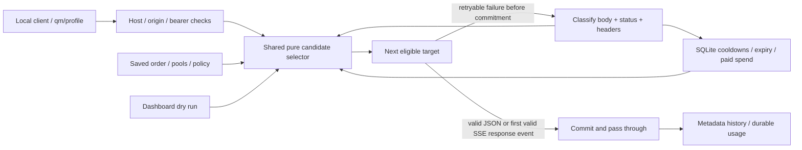

<div align="center">

# QuotaMesh


### Your local AI API capacity gateway

Use the API access you already own through one local endpoint, with explicit order and safe fallback.

[Quick start](#quick-start) · [No-key demo](#test-without-api-keys) · [Routing rules](#how-routing-works) · [Credentials](#what-you-need-for-real-provider-testing) · [Development](#development)

</div>

**Current scope: finalized MVP, phases one through five (v0.1.0).** QuotaMesh has an authenticated localhost
Chat Completions gateway, deterministic fallback, shared cooldowns, expiry and paid caps,
a grouped FREE/TRIAL/PAID Capacity Wallet, editable credentials, named Project Profiles,
durable local usage with expandable metadata-only history, Available Now/Explain Route,
generated integration snippets, on-demand Doctor, environment import, and a dated Access Catalog. Existing `qm/default`
clients keep working; each new project uses `qm/<slug>`. This is a local developer utility with explicit compatibility boundaries.

QuotaMesh does not create capacity, bypass limits, or make paid calls free. Counts and
balances cover traffic through this gateway; provider quota stays unknown. Phase five finalizes release packaging, platform QA, documentation, and frontend polish. No live-provider readiness is implied.

## Quick start

Python **3.11+**, one process, loopback only. No Docker, Redis, database server, or frontend build.

```sh
git clone https://github.com/yashsrivastava0/QuotaMesh.git
cd QuotaMesh
python3 -m venv .venv
.venv/bin/python -m pip install -e .
.venv/bin/quotamesh start
```

On Windows, use the equivalent `.venv\Scripts\` commands. The CLI prints a one-time
dashboard link; opening it creates an HttpOnly, SameSite Strict browser session and
redirects to a clean URL. The default port is 8787.

In the dashboard:

1. **Add API access.** Choose a provider, plan, and either a secret or an environment
   reference. Label is optional; custom endpoints also need a base URL. No model is
   needed to save a credential. **Save as untested** makes no provider call; **Save and test
   listing access** explicitly contacts `/models` without generating a response.
2. **Review My AI Capacity.** Shared provider/quota groups appear once with their keys,
   observed usage, expiry, model states and source badges. Starting dollar credit is
   manual; estimated remaining credit is local, never a live provider balance.
3. **Save a Project Profile.** Keep default or create a name and immutable slug. Choose
   exact provider/model targets, key pools or pinned keys, order, permissions, and caps.
   Templates only edit the form; inspect and save the explicit result. Paid starts off.
4. **Explain and connect.** Available Now shows the saved policy's eligible and skipped
   candidates, paid-cap evidence, and recovery times. Connect generates Python, Node,
   cURL/PowerShell, environment and OpenCode instructions for the selected saved profile.
5. **Test and inspect.** The dry run makes no network call. An explicit test follows the
   selected saved profile and can spend real quota when allowed. Expand its history to
   see ordered attempts and skips; prompts and responses are never saved there.

Doctor lists models or tests exactly one selected profile target. Generation requires an
explicit quota-use action and obeys the saved paid rules; it never falls back to another
key. Listing success does not prove generation permissions or remaining quota.

To update an existing checkout, run `git switch main` and `git pull --ff-only` before
installing. Back up your data directory before upgrading; schema v1/v2/v3/v4 migrates to v5.

## Test without API keys

```sh
.venv/bin/quotamesh demo
```

The demo runs on **127.0.0.1:8788**, prints a one-time dashboard link, uses temporary
data, mounts a local fake provider, and deletes its store on exit. It starts with free,
trial and paid sources, two trial keys sharing one $20 credit balance, and named profiles.
Use the test panel; dollars, expiry and responses here are simulated. Doctor model listing
is simulated too. The CLI prints an isolated `key --data-dir` command; Connect uses that
command in the demo environment snippet instead of reading your normal gateway key.

| Scenario | What to observe |
| --- | --- |
| Mixed wallet + profiles | One shared trial source with two keys; route `paid-backup` to observe $0.60 and a $19.40 local estimate. `free-app` permits free access only. |
| Rate limit → free backup | Two upstream attempts; persisted cooldown; next request selects the backup directly. |
| Paid guard | Both free sources fail; paid stays blocked. |
| Paid cap | Paid explicitly enabled; $0.60 per call reaches/overshoots the $1 daily cap, then blocks. |
| Shared project | One 429 blocks its sibling for the same group/model; one upstream attempt. |
| First SSE error | Enable streaming; pre-commit failure falls back. |
| Mid-stream cut | Enable streaming; one committed provider, then interruption with no fallback. |

Loading a scenario resets only this temporary demo's profiles, history, rollups and quota
state. `quotamesh key` reads your normal data directory, not the temporary demo's key.
For a separate fake provider, run `.venv/bin/quotamesh fake-upstream` on port 8799; use
Custom, `http://127.0.0.1:8799/v1`, FREE, any fake model and a secret such as `fake-200`,
`fake-429-short` or `fake-401`.

## How routing works



- Targets follow saved order. Pools use ascending priority, then credential ID.
- Skips do not consume the attempt budget. No same-key/model retry or waiting through
  cooldowns. Default budget: five upstream attempts, 45 seconds total non-stream time,
  or 30 seconds total to the first valid stream response; stream idle timeout: 60 seconds.
- Auth/revoked-key failures invalidate the credential. Billing/account failures mark it
  unusable. Model access 403 blocks that key/model briefly; 404 and network/5xx failures
  temporarily block the provider/model. Generic malformed 400/422 requests are returned
  as-is. Context-length failures move to the next explicitly configured target.
- 429 state is shared by **provider + quota group + model**. Independent group labels
  do not manufacture independent quota. Group keys belonging to the same project/account.
  Blank groups conservatively share a provider default; Groq defaults to separate keys,
  with explicit grouping when you know their limits are shared.
- Retry-After and supported reset headers win. Unknown 429s use `5s → 15s → 60s → 5m →
  30m → 2h`, remaining COOLDOWN. Daily exhaustion requires explicit evidence and a reset;
  Gemini's documented daily reset is Pacific midnight, including daylight saving time.
- A role-only SSE response event commits the provider. Comments do not. Error-first or
  malformed streams can fall back; after commitment there is **no provider switch**.
  Missing `[DONE]` is an interruption. Cancellation closes the upstream.
- **Reset shared state** clears credential invalidity and its shared quota group. It
  does not restore provider quota, fix an invalid key, change expiry, or clear paid spend.
  Use Edit / rotate to replace a secret or environment reference. Rotation keeps shared
  cooldowns and spending; metadata-only edits preserve the current secret.

Profile names can change; slugs cannot. Deleting a profile archives its identity and
reserves its slug, retaining spend and history. Default can be disabled, not deleted.
Deleting a key removes its secret record and archives metadata; first remove any pinned
targets. Provider changes also require removing pins. Provider pools join matching keys
dynamically; adding a key does not create new quota.

If all candidates are already blocked, a recovery within 60 seconds yields local
429 + Retry-After; otherwise local 503 includes sanitized candidate reasons. After real
attempts, a terminal/budget-exhausted failure returns the last upstream/local error.

### Paid caps and cost truth

Paid and UNKNOWN plans need explicit permission in the selected profile. Caps and
usage are scoped to that profile; provider/group/model cooldowns are shared across profiles. Optional daily/monthly caps use
**UTC calendar windows and only paid traffic through QuotaMesh**. Daily rollups survive
request-history deletion. Caps check observed spend before selection; concurrent and
in-flight requests may overshoot by their final costs. They are not provider billing controls.

No volatile model prices are bundled. Enter **both input and output USD prices per
million tokens** for a local estimate. Explicit provider `usage.cost_usd` wins over that
estimate; provider-specific documented cost fields can be recognized where implemented.
A generic `usage.cost` or arbitrary “credits” field is not assumed to mean USD. Missing
usage/cost stays unknown; capped paid routing then blocks unless you explicitly allow
unknown cost. That override reduces the cap's protection. Use provider-side budgets too.

If paid metadata/accounting cannot be written, the completed response still reaches the
caller, diagnostic failures increase, and paid routing fails closed. A local marker keeps
that block across restarts. Repair the storage problem and reconcile missing spend before
removing `<QUOTAMESH_DATA_DIR>/paid-accounting-incomplete`; resetting a key does not clear it.

## Connect a client

The dashboard's **Connect** section uses the actual port and selected saved profile. Set
its generated environment variables first, then copy the client snippet. On Windows,
choose PowerShell. OpenCode configuration uses `@ai-sdk/openai-compatible` for Chat
Completions and an environment key reference; merge it into your existing configuration.
Native Responses/Messages clients remain outside this milestone.

```sh
export QUOTAMESH_KEY="$(.venv/bin/quotamesh key)"
curl http://127.0.0.1:8787/v1/chat/completions \
  -H "Authorization: Bearer $QUOTAMESH_KEY" \
  -H 'Content-Type: application/json' \
  -d '{"model":"qm/default","messages":[{"role":"user","content":"Hello"}]}'
```

For the OpenAI Python SDK, install `openai` separately and use
`base_url="http://127.0.0.1:8787/v1"`, your local gateway key, and `model="qm/default"`.
Use a saved alias such as `model="qm/free-app"` for another project; `GET /v1/models`
lists enabled, non-archived profile aliases. Add `stream: true` for SSE. The gateway swaps only the selected model and preserves
other JSON extension fields and original successful upstream bytes.

## What you need for real provider testing

**No secret is needed for the demo or automated tests.** For a real request, prepare:

- An API key for an account you are authorized to use, plus a model available to that account.
- Its correct plan classification and, for expiring access, the expiry date.
- A shared provider project/account quota-group label when several keys share limits.
- For capped paid access, current input/output USD-per-million-token prices. Start with
  paid disabled; enable it deliberately only after reviewing your provider billing settings.

Enter the key in the dashboard or set a variable such as `QM_OPENAI_KEY`,
`QM_GEMINI_KEY`, `QM_GROQ_KEY`, or `QM_NIM_KEY` **before starting QuotaMesh**, then enter
that variable's name in the credential form. Variables are references, not automatic
provider imports; `.env` files are not loaded. Changing a process variable requires restart.
The environment preview/import recognizes `OPENAI_API_KEY`, `GEMINI_API_KEY`,
`GOOGLE_API_KEY`, `GROQ_API_KEY`, and `NVIDIA_API_KEY` in the **server process**.
It never returns values, creates references as UNKNOWN by default, and changes no profile
targets or permissions. Review the declared plan before deliberately allowing paid use.
The local gateway key is generated automatically; there is no QuotaMesh cloud API key.

Cloud users should enter secrets securely in environment settings, not chat. If proxy
secrets are used, scope them to the corresponding API destination. Required real-provider
hosts are `api.openai.com`, `generativelanguage.googleapis.com`, `api.groq.com`, and
`integrate.api.nvidia.com`, or your custom endpoint. Prefer non-reserved variable names
like the `QM_*` examples above. Add only the destinations you actually use.

Provider-free tests verify the decision engine. They do **not** establish live account
permissions, available models, or every provider feature. The Access Catalog links to
official provider documentation with dated, cautious notes; it is not quota or pricing
truth. No live provider calls were made during Phase 4 verification.

### Small CLI utilities

Commands below contact the running local server, using its local key and data directory.
Use `--port` for a non-default port; environment import reads the server's environment.

```sh
quotamesh doctor 1
quotamesh doctor 1 --generation --consent --profile default --position 1
quotamesh profile test default
quotamesh env default --shell bash
quotamesh import-env OPENAI_API_KEY
quotamesh add --provider openai --plan UNKNOWN --env-name OPENAI_API_KEY
quotamesh reset 1
quotamesh tail
```

`add` prompts privately for a key when no environment reference is supplied. `reset`
does not restore quota or erase spend. `tail` contains metadata notifications only.

## Local API and security

| Endpoint | Purpose | Access |
| --- | --- | --- |
| `GET /health` | Process liveness, not provider readiness | None |
| `GET /v1/models` | Enabled profile aliases | Local bearer key |
| `POST /v1/chat/completions` | Stream/non-stream routing | Local bearer key |
| `GET /api/status`, `/api/dry-run` | Safe metadata / shared selector; optional `?profile=slug` | Browser session or local bearer |
| `GET /api/explain` | One snapshot: candidates, skips, cap evidence and recovery; optional `profile` | Browser session or local bearer |
| `GET /api/integrations` | Snippets; optional `profile` and `shell=bash\|powershell` | Browser session or local bearer |
| `GET /api/doctor`, `POST /api/doctor` | Sanitized observations / explicit listing or single-target generation | Browser session or local bearer |
| `GET /api/environment`, `POST /api/environment/import` | Known server variable names / reference import | Browser session or local bearer |
| `GET /api/catalog` | Dated docs/access links and configured preset state | Browser session or local bearer |
| `GET /events` | Bounded metadata-only local activity SSE | Browser session or local bearer |
| `POST /api/credentials` | Add a write-only credential, no model required | Browser session or local bearer |
| `PATCH /api/credentials/{id}`, `DELETE /api/credentials/{id}` | Edit/rotate or archive a credential; omitted secret fields preserve it | Browser session or local bearer |
| `GET /api/wallet` | Grouped sources and observed usage with truth badges | Browser session or local bearer |
| `GET /api/profiles`, `POST /api/profiles` | List/create named profiles | Browser session or local bearer |
| `PUT /api/profiles/{slug}`, `DELETE /api/profiles/{slug}` | Replace full profile policy or archive it | Browser session or local bearer |
| `GET /api/usage` | Durable per-day/profile/key/model/plan rows; optional `profile`, `day` | Browser session or local bearer |
| `GET /api/activity` | Request traces; optional `profile`, `limit` (1–100), `before` cursor | Browser session or local bearer |
| `POST /api/policy` | Save ordered default policy | Browser session or local bearer |
| `POST /api/credentials/{id}/action` | Enable, disable, or reset shared state | Browser session or local bearer |
| `POST /api/test` | Explicit test using the gateway handler | Browser session or local bearer |
| `POST /api/demo` | Reset a scenario; isolated demo only | Browser session or local bearer |
| `POST /api/connection` | Legacy single-connection replacement; replaces default targets | Browser session or local bearer |

The service binds to `127.0.0.1` with one worker. Host/origin checks, no CORS, random
bearer/session tokens, HTTPS remote endpoints, and blocked redirects protect local
credentials. Prompts and responses are **never persisted** or logged by QuotaMesh.
History contains attempt IDs, target metadata, timing, outcome, token usage, and cost only.
Client-provided labels are not persisted. There is no telemetry or background quota probing.

Secrets entered directly are plaintext in local SQLite, with restrictive Unix permissions;
Windows does not provide equivalent guarantees through POSIX mode bits. Data defaults to
`~/.local/share/quotamesh` or `%LOCALAPPDATA%/QuotaMesh`. Set `QUOTAMESH_DATA_DIR` to isolate
it. Schema v1/v2/v3/v4 upgrades to v5; additions are transactional. Back up before upgrading. Older builds
cannot read v5. Paid cap totals survive upgrades, deletion and pruning. Retained attempts
are backfilled once; earlier pruned detail cannot be reconstructed and coverage is labeled.
Legacy paid costs without evidence stay unknown. Estimated remaining credit stays unknown
for legacy stores with incomplete coverage, missing cost, or conflicting starting amounts.

History retains at most 30 days and 50,000 attempts, keeping complete traces at the row
boundary. Daily rollups are never pruned automatically. One request with fallback counts
once as a routed request but can have several upstream attempts; rejected/no-capacity
requests that make no upstream call are excluded from these observation counts.
`quotamesh status` shows the grouped wallet and all named profile summaries.

## Development

```sh
.venv/bin/python -m pip install -e '.[dev]' build
.venv/bin/ruff check .
.venv/bin/pytest -q
.venv/bin/python -m build
```

An optional real-browser check uses Playwright Chromium:

```sh
.venv/bin/python -m pip install playwright
.venv/bin/playwright install chromium
.venv/bin/python scripts/browser_smoke.py
```

Set `CHROMIUM_PATH=/path/to/chromium` to use a system browser instead. The smoke script launches and stops its
own isolated demo, checks the mixed wallet, profile CRUD, credential editing/rotation,
streaming/credit/history, all six failure scenarios, Doctor, snippets/copy fallback,
paid-generation blocking, rapid profile switches, draft preservation, and responsive layouts.
Playwright is a verification tool, not an application dependency.

Record the synthetic product walkthrough with `python scripts/record_demo.py`.
It writes `output/phase-five/quotamesh-final.webm` and uses temporary fake data only.
Generated recordings, screenshots and verification environments are not committed.

Use a task branch and Conventional Commits; see [CONTRIBUTING.md](CONTRIBUTING.md).
See [architecture](docs/architecture.md), [phase-two plan](docs/phase-two-plan.md), [phase-three plan](docs/phase-three-plan.md), [Phase 4 implementation](docs/phase-four-plan.md), and
[ROADMAP.md](ROADMAP.md). The [65-page product PDF](QuotaMesh_MVP_Architecture_Product_Spec_v0.3.pdf)
is product intent; the roadmap separates delivered phases one–four from release and later extensions.

## Final release and testing

Read [the complete testing guide](docs/final-testing-guide.md) for first-run setup,
manual scenarios, expected results, upgrades, troubleshooting, and the full PDF
checklist mapping. [Release evidence](docs/release-evidence.md) records actual
results and publishing status. Version 0.1.0 uses the MIT license.

The first-run panel creates `qm/default` from a saved key and exact model with paid
use disabled. Choose your plan explicitly. Duplicate access for the same provider
and endpoint is rejected; existing aliases cannot retry the same effective key/model
or bypass its observed cooldown. One gateway may own a data directory at a time.

Timing and allowlisted OpenAI/Groq rate-header evidence are passive observations,
not live quota. Groq request headers describe a day window, token headers a minute
window. Snapshots become stale after at most 60 seconds or their earlier reset.
Compatibility presets now include Anthropic, xAI, OpenRouter, Cerebras, and Mistral;
these are generic transports, not native protocol or live-account guarantees.

After public PyPI publication, `uvx quotamesh start` is the one-command entry point.
Until then, use the verified release wheel:

```sh
uvx --from ./dist/quotamesh-0.1.0-py3-none-any.whl quotamesh start
```

Release verification launches real installed processes, fake providers, two keys on
one provider, streaming and restart without consuming quota:

```sh
python scripts/release_smoke.py --wheel dist/quotamesh-0.1.0-py3-none-any.whl
python -m pip install openai playwright
npm install --prefix output/phase-four/node-client --no-audit --no-fund openai @ai-sdk/openai-compatible
python scripts/integration_smoke.py
```

SDKs and Playwright are verification dependencies only. The SDK harness's ignored
`output/phase-four/node-client` location is retained for existing CI compatibility;
new screenshots and recordings use `output/phase-five`. Generate the final guide PDF
with `pip install reportlab` and `python scripts/build_testing_guide.py`.

Publishing uses GitHub OIDC in `.github/workflows/release.yml`, with an explicit
release tag and optional publish input. The authorized PyPI account must configure
its Trusted Publisher; no publishing secret is stored in this repository.
