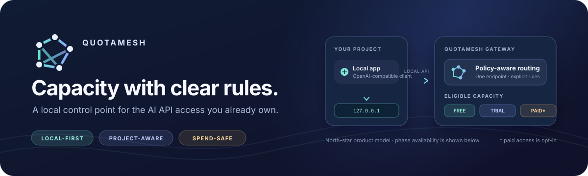
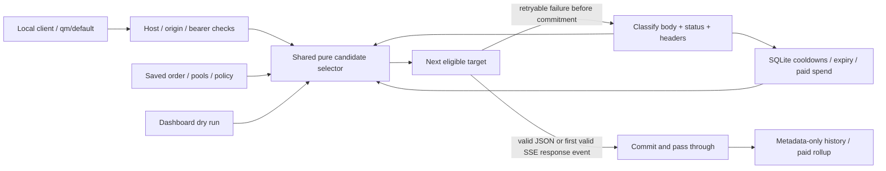

<div align="center">

# QuotaMesh



### Your local AI API capacity gateway

Use the API access you already own through one local endpoint, with explicit order and safe fallback.

[Quick start](#quick-start) · [No-key demo](#test-without-api-keys) · [Routing rules](#how-routing-works) · [Credentials](#what-you-need-for-real-provider-testing) · [Development](#development)

</div>

**Current scope: phases one and two.** The authenticated localhost gateway now supports
ordered targets and key pools, body-aware fallback, persistent shared quota cooldowns,
expiry, paid guardrails, and a route-testing dashboard. It currently has **one default
policy (`qm/default`)**. The full Capacity Wallet and named Project Profiles are phase
three; Responses and Anthropic Messages are deferred. This is an alpha developer tool.

QuotaMesh does not create capacity, bypass limits, or make paid API calls free. The
product direction is a local wallet for mixed free/trial/paid access; this phase proves
the decision engine before building that broader product.

## Quick start

Python **3.11+**, one process, loopback only. No Docker, Redis, database server, or frontend build.

```sh
git clone https://github.com/yashsrivastava0/QuotaMesh.git
cd QuotaMesh
python3 -m venv .venv
.venv/bin/python -m pip install -e .
.venv/bin/quotamesh start
```

On Windows, use the equivalent `.venv\Scripts\` commands. The CLI prints a one-time
dashboard link; opening it creates an HttpOnly, SameSite Strict browser session and
redirects to a clean URL. The default port is 8787.

In the dashboard:

1. **Add API access.** Choose a provider, plan, label, and either a secret or an
   environment variable name. Saving does not call the provider or spend quota.
2. **Save route rules.** Add provider/model targets in your intended order. Pin a
   credential or choose its provider pool. Enter the actual model ID your account can use.
3. **Read the dry run.** It explains eligibility and skips without a provider call.
   Eligibility is local policy/state, not a promise of remaining provider quota.
4. **Send an explicit test.** The test uses the real gateway handler, shows response
   text and attempts, and can use quota or money if the route permits it.

Only save fallback models you intentionally want to use; they are not interchangeable
in quality or supported features. Paid/unknown-plan access starts disabled.

## Test without API keys

```sh
.venv/bin/quotamesh demo
```

The demo starts on port 8788 with **temporary data**, separate from your normal
configuration. It mounts a fake upstream in the same process; it never contacts a
provider. Open the printed one-time link and choose a scenario:

| Scenario | What to observe |
| --- | --- |
| Rate limit → free backup | Primary cools; second free credential serves; two attempts. |
| Both free fail → paid blocked | No paid request; dry run explains the paid skip. |
| Paid backup → $1 daily cap | Two fake paid successes total $1.20; further paid routing is blocked. This demonstrates final-cost overshoot. |
| Shared project | One 429 blocks its sibling for the same group/model; one upstream attempt. |
| First SSE error | Enable streaming; failure before commitment falls back to the backup. |
| Mid-stream cut | Enable streaming; one committed provider, then a visible interruption and no fallback. |

Reloading a scenario resets this temporary demo's history, quota states, and policy.
The demo's test panel uses its browser session; `quotamesh key` reads the normal data
directory's key and is not the temporary demo key.

For a separate fake provider, `.venv/bin/quotamesh fake-upstream` listens on port 8799.
Use the **Custom** preset, `http://127.0.0.1:8799/v1`, any fake model, FREE, and a fake
secret such as `fake-200`, `fake-429-short`, or `fake-401`.

## How routing works



- Targets follow saved order. Pools use ascending priority, then credential ID.
- Skips do not consume the attempt budget. No same-key/model retry or waiting through
  cooldowns. Default budget: five upstream attempts, 45 seconds total non-stream time,
  or 30 seconds total to the first valid stream response; stream idle timeout: 60 seconds.
- Auth/revoked-key failures invalidate the credential. Billing/account failures mark it
  unusable. Model access 403 blocks that key/model briefly; 404 and network/5xx failures
  temporarily block the provider/model. Generic malformed 400/422 requests are returned
  as-is. Context-length failures move to the next explicitly configured target.
- 429 state is shared by **provider + quota group + model**. Independent group labels
  do not manufacture independent quota. Group keys belonging to the same project/account.
  Blank groups conservatively share a provider default; Groq defaults to separate keys,
  with explicit grouping when you know their limits are shared.
- Retry-After and supported reset headers win. Unknown 429s use `5s → 15s → 60s → 5m →
  30m → 2h`, remaining COOLDOWN. Daily exhaustion requires explicit evidence and a reset;
  Gemini's documented daily reset is Pacific midnight, including daylight saving time.
- A role-only SSE response event commits the provider. Comments do not. Error-first or
  malformed streams can fall back; after commitment there is **no provider switch**.
  Missing `[DONE]` is an interruption. Cancellation closes the upstream.
- **Reset shared state** clears credential invalidity and its shared quota group. It
  does not restore provider quota, fix an invalid key, change expiry, or clear paid spend.
  Rotate rejected keys by adding a replacement and changing the target; disable the old key.

If all candidates are already blocked, a recovery within 60 seconds yields local
429 + Retry-After; otherwise local 503 includes sanitized candidate reasons. After real
attempts, a terminal/budget-exhausted failure returns the last upstream/local error.

### Paid caps and cost truth

Paid and UNKNOWN plans need explicit route permission. Optional daily/monthly caps use
**UTC calendar windows and only paid traffic through QuotaMesh**. Daily rollups survive
request-history deletion. Caps check observed spend before selection; concurrent and
in-flight requests may overshoot by their final costs. They are not provider billing controls.

No volatile model prices are bundled. Enter **both input and output USD prices per
million tokens** for a local estimate. Explicit provider `usage.cost_usd` wins over that
estimate; provider-specific documented cost fields can be recognized where implemented.
A generic `usage.cost` or arbitrary “credits” field is not assumed to mean USD. Missing
usage/cost stays unknown; capped paid routing then blocks unless you explicitly allow
unknown cost. That override reduces the cap's protection. Use provider-side budgets too.

If paid metadata/accounting cannot be written, the completed response still reaches the
caller, diagnostic failures increase, and paid routing fails closed. A local marker keeps
that block across restarts. Repair the storage problem and reconcile missing spend before
removing `<QUOTAMESH_DATA_DIR>/paid-accounting-incomplete`; resetting a key does not clear it.

## Connect a client

```sh
export QUOTAMESH_KEY="$(.venv/bin/quotamesh key)"
curl http://127.0.0.1:8787/v1/chat/completions \
  -H "Authorization: Bearer $QUOTAMESH_KEY" \
  -H 'Content-Type: application/json' \
  -d '{"model":"qm/default","messages":[{"role":"user","content":"Hello"}]}'
```

For the OpenAI Python SDK, install `openai` separately and use
`base_url="http://127.0.0.1:8787/v1"`, your local gateway key, and `model="qm/default"`.
Add `stream: true` for SSE. The gateway swaps only the selected model and preserves
other JSON extension fields and original successful upstream bytes.

## What you need for real provider testing

**No secret is needed for the demo or automated tests.** For a real request, prepare:

- An API key for an account you are authorized to use, plus a model available to that account.
- Its correct plan classification and, for expiring access, the expiry date.
- A shared provider project/account quota-group label when several keys share limits.
- For capped paid access, current input/output USD-per-million-token prices. Start with
  paid disabled; enable it deliberately only after reviewing your provider billing settings.

Enter the key in the dashboard or set a variable such as `QM_OPENAI_KEY`,
`QM_GEMINI_KEY`, `QM_GROQ_KEY`, or `QM_NIM_KEY` **before starting QuotaMesh**, then enter
that variable's name in the credential form. Variables are references, not automatic
provider imports; `.env` files are not loaded. Changing a process variable requires restart.
The local gateway key is generated automatically; there is no QuotaMesh cloud API key.

Cloud users should enter secrets securely in environment settings, not chat. If proxy
secrets are used, scope them to the corresponding API destination. Required real-provider
hosts are `api.openai.com`, `generativelanguage.googleapis.com`, `api.groq.com`, and
`integrate.api.nvidia.com`, or your custom endpoint. Prefer non-reserved variable names
like the `QM_*` examples above. Add only the destinations you actually use.

Provider-free tests verify the decision engine. They do **not** establish live account
permissions, available models, or every provider feature. Google/OpenAI documentation was
checked during this implementation; Groq/NVIDIA documentation returned HTTP 403 in this
machine, and no live provider calls were made. See [the implementation plan](docs/phase-two-plan.md).

## Local API and security

| Endpoint | Purpose | Access |
| --- | --- | --- |
| `GET /health` | Process liveness, not provider readiness | None |
| `GET /v1/models` | Default profile alias | Local bearer key |
| `POST /v1/chat/completions` | Stream/non-stream routing | Local bearer key |
| `GET /api/status`, `/api/dry-run` | Safe metadata / shared selector | Browser session or local bearer |
| `POST /api/credentials` | Add a write-only credential | Browser session or local bearer |
| `POST /api/policy` | Save ordered default policy | Browser session or local bearer |
| `POST /api/credentials/{id}/action` | Enable, disable, or reset shared state | Browser session or local bearer |
| `POST /api/test` | Explicit test using the gateway handler | Browser session or local bearer |
| `POST /api/demo` | Reset a scenario; isolated demo only | Browser session or local bearer |
| `POST /api/connection` | Legacy single-connection replacement; replaces default targets | Browser session or local bearer |

The service binds to `127.0.0.1` with one worker. Host/origin checks, no CORS, random
bearer/session tokens, HTTPS remote endpoints, and blocked redirects protect local
credentials. Prompts and responses are **never persisted** or logged by QuotaMesh.
History contains attempt IDs, target metadata, timing, outcome, token usage, and cost only.
Client-provided labels are not persisted. There is no telemetry or background quota probing.

Secrets entered directly are plaintext in local SQLite, with restrictive Unix permissions;
Windows does not provide equivalent guarantees through POSIX mode bits. Data defaults to
`~/.local/share/quotamesh` or `%LOCALAPPDATA%/QuotaMesh`. Set `QUOTAMESH_DATA_DIR` to isolate
it. Schema v1 migrates additively to v2; back up that directory before upgrading. Older
phase-one binaries cannot read v2. Legacy paid usage with no reliable costs stays unknown.

## Development

```sh
.venv/bin/python -m pip install -e '.[dev]' build
.venv/bin/ruff check .
.venv/bin/pytest -q
.venv/bin/python -m build
```

An optional real-browser check uses system Chromium:

```sh
.venv/bin/python -m pip install playwright
.venv/bin/python scripts/browser_smoke.py
```

Set `CHROMIUM_PATH` when Chromium is elsewhere. The smoke script launches and stops its
own isolated demo, checks all six scenarios, policy/credential forms, and mobile overflow.
Playwright is a verification tool, not an application dependency.

Use a task branch and Conventional Commits; see [CONTRIBUTING.md](CONTRIBUTING.md).
See [architecture](docs/architecture.md), [phase-two plan](docs/phase-two-plan.md), and
[ROADMAP.md](ROADMAP.md). The [65-page product PDF](QuotaMesh_MVP_Architecture_Product_Spec_v0.3.pdf)
is product intent; the roadmap separates the phase-two deliverable from the full MVP.
