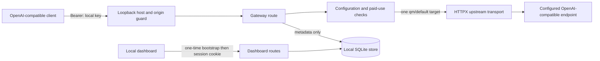

# Phase 1 architecture

QuotaMesh currently runs as one local Python process. FastAPI serves the setup dashboard and an OpenAI Chat Completions-compatible endpoint; SQLite stores the single configured target, local gateway key, and request metadata. The boundary follows the product spec's local gateway and pass-through path while deferring selection, wallet, and multi-profile behavior to later roadmap phases.

## Request path

## Code boundaries

- `app.py` constructs shared state, the HTTP client and application lifespan, applies the local request guard, and wires route groups.
- `routes/dashboard.py` owns browser setup and management endpoints. It validates fields before persisting configuration.
- `routes/gateway.py` authenticates model requests, applies the single-target Phase 1 checks, proxies raw Chat Completions fields, and handles upstream SSE commitment.
- `security.py` owns local host/origin and authorization checks.
- `store.py` owns SQLite schema creation/migrations and data access. Attempt rows contain metadata and never request or response bodies.
- `config.py` and `registry/providers.toml` own local data paths, URL/environment-name validation, and provider endpoint metadata.
- `ui/` contains server-rendered HTML and CSS; it does not call third-party APIs directly.

## Trust and compatibility boundaries

- The server listens on `127.0.0.1`. The browser's first-run link is single-use; the resulting cookie is HttpOnly and SameSite Strict. Model routes require the generated local bearer key.
- Remote custom endpoints require HTTPS. Redirects are not followed. The API key is passed only to the configured endpoint.
- PAID and UNKNOWN plans require explicit opt-in. Phase 1 has no dollar cap, automatic fallback, or quota guarantee.
- Supported traffic is `/v1/chat/completions` and `/v1/models`. Responses API, Anthropic Messages, provider-specific normalization, and direct provider traffic visibility are outside this phase.
- SQLite secrets are protected by local file permissions where supported, but are not encrypted. Environment references are available when a secret should not be written to the database.

The product source is [`../QuotaMesh_MVP_Architecture_Product_Spec_v0.3.pdf`](../QuotaMesh_MVP_Architecture_Product_Spec_v0.3.pdf). Known scope and assumptions are tracked in [`../ROADMAP.md`](../ROADMAP.md).
